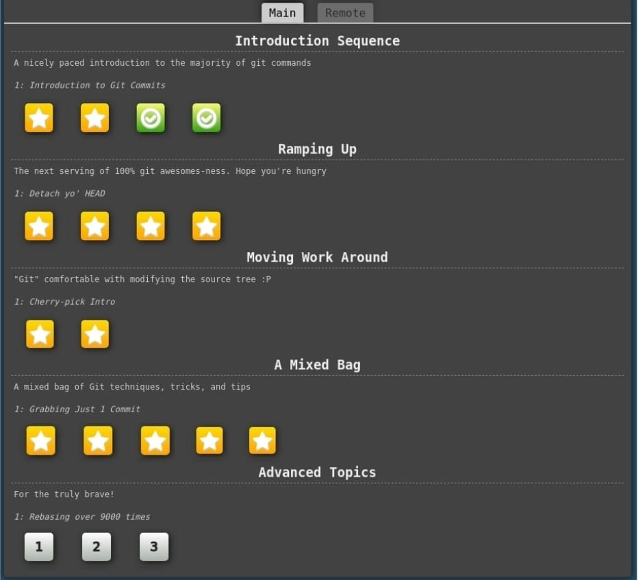
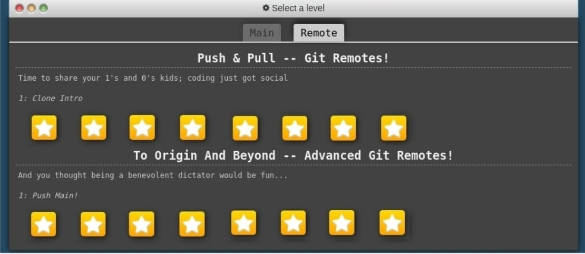

# Laboratorio 2

## Ejercicios de Github

Se realizan los ejercicios indicados de la página web. Debido a que ya tenía conocimiento de Github, algunos resultaron muy básicos, sin embargo, sí aprendí cosas como el rebase, por ejemplo. 

Me pareció que la representación visual usada en la página web fue bastante útil para entender bien todos los conceptos a fondo.

## Documentación Automática con Doxygen y Sphinx

### Doxygen en C++

El proyecto que se documentó fue una calculadora básica, la cual permite realizar operaciones aritméticas fundamentales (suma, resta, multiplicación y división) entre dos enteros. El código fue documentado utilizando comentarios en formato Doxygen, lo cual permitió generar documentación técnica en formato HTML, clara y estructurada.

### Sphinx en Python

El proyecto que se documentó fue una simulación de cuenta bancaria modela una cuenta bancaria con funcionalidades básicas como depositar, retirar y consultar el saldo. La documentación fue generada con Sphinx a partir de comentarios doctring en estilo reStructuredText, produciendo un sitio HTML navegable.

Ambos proyectos fueron documentados sin alterar la lógica original del código, enfocándose exclusivamente en la generación de documentación técnica automatizada. No obstante, no fue posible traerlos a una página web, a pesar de que se generó correctamente la carpeta HTML tanto con sphinx como con doxygen.