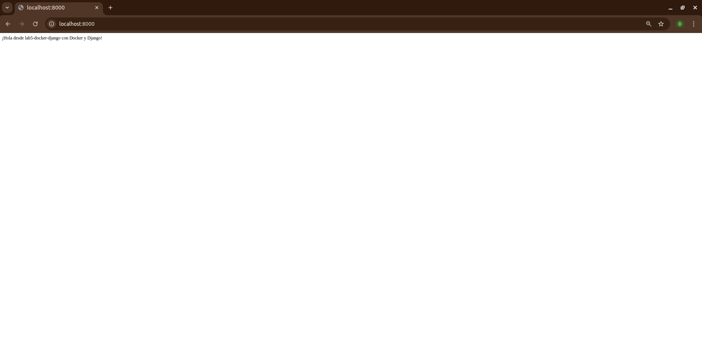

# 📄 Documentación del Laboratorio 5 - IE0417  
**Despliegue de una Aplicación Django con Docker**

---

## 👥 Equipo
**Diego Acosta**  
**Josué Zúñiga**

---

## 1. 🧾 Descripción General

Este laboratorio tuvo como objetivo principal comprender y aplicar el ciclo completo de despliegue de una aplicación web utilizando Docker, con énfasis en la infraestructura y no en el desarrollo de la lógica de negocio.  
Se trabajó con una aplicación Django mínima, contenedorizada con Docker y orquestada mediante Docker Compose, integrando una base de datos PostgreSQL, red personalizada y almacenamiento persistente.

La solución permite:

- Despliegue automático del entorno completo con un solo comando.
- Separación clara de responsabilidades (base de datos vs. aplicación web).
- Persistencia de datos entre reinicios de contenedores.
- Aislamiento de servicios mediante redes Docker.

---

## 2. 🏗️ Arquitectura del Proyecto

La arquitectura se diseñó bajo el enfoque de microservicios en contenedores independientes. A continuación, se describen los principales componentes:

- **Web (Django):**  
  Servicio que ejecuta la aplicación web mediante Gunicorn. Se construye a partir de un `Dockerfile` personalizado y se conecta a la base de datos utilizando variables de entorno seguras.

- **Base de Datos (PostgreSQL):**  
  Contenedor oficial de PostgreSQL, parametrizado mediante `.env` y con almacenamiento persistente a través de un volumen.

- **Red Docker (backend):**  
  Red bridge personalizada que asegura la comunicación entre `web` y `db`, evitando colisiones con otras redes del host.

- **Volumen Docker (dbdata):**  
  Almacena de forma persistente los datos de la base de datos, incluso si el contenedor es eliminado o recreado.

---

## 3. 🧾 Descripción de Archivos Clave

### 🔹 3.1 `Dockerfile`

Contiene las instrucciones para construir una imagen optimizada para producción basada en `python:3.11-slim`.  
Instala dependencias, configura el entorno de trabajo y define el comando de arranque con Gunicorn. Incluye también utilidades como `netcat-openbsd` para esperar activamente la conexión con la base de datos antes de iniciar el servidor web.

---

### 🔹 3.2 `docker-compose.yml`

Archivo de orquestación que:

- Define los servicios `web` y `db`.
- Conecta ambos mediante la red `backend`.
- Establece un volumen llamado `dbdata` para la base de datos.
- Carga variables de entorno desde el archivo `.env`.
- Asegura que el servicio `web` dependa de la disponibilidad del servicio `db`.

---

### 🔹 3.3 `entrypoint.sh`

Script personalizado ejecutado como punto de entrada en el contenedor `web`.  
Su funcionalidad incluye:

- Esperar que la base de datos esté lista utilizando `nc`.
- Aplicar migraciones automáticamente.
- Recolectar archivos estáticos.
- Iniciar Gunicorn como servidor WSGI para servir la aplicación Django.

Esto garantiza que el entorno esté completamente funcional en cada despliegue.

---

### 🔹 3.4 `settings.py`

Archivo de configuración principal de Django modificado para producción.  
Incluye:

- Configuración de conexión a base de datos PostgreSQL mediante variables de entorno.
- Registro de aplicaciones instaladas, incluyendo la app principal `core`.
- Configuración de `STATIC_ROOT` para la gestión de archivos estáticos.
- Seguridad básica para despliegue local.

---

### 🔹 3.5 `core/views.py`

Contiene una vista base (`home`) que responde a la raíz del sitio (`/`) con un mensaje simple.  
Este endpoint permite validar que el entorno está correctamente desplegado y funcional.

---

## 4. 🚀 Instrucciones de Ejecución

Para levantar el entorno desde cero:

1. Clonar o descargar el repositorio.
2. Ingresar al directorio raíz del proyecto.
3. Ejecutar el siguiente comando:

   ```bash
   docker-compose up --build
   ```

4. Una vez completado el proceso de construcción e inicialización, la aplicación estará accesible desde el navegador en:

   ```
   http://localhost:8000
   ```

5. Para detener los contenedores:

   ```bash
   docker-compose down
   ```

---

## 5. 📸 Evidencia de Funcionamiento

La siguiente imagen muestra la página de inicio de la aplicación desplegada correctamente a través de Docker:



> *Figura 1: Aplicación Django funcionando correctamente desde el contenedor `web` tras inicialización del entorno.*
